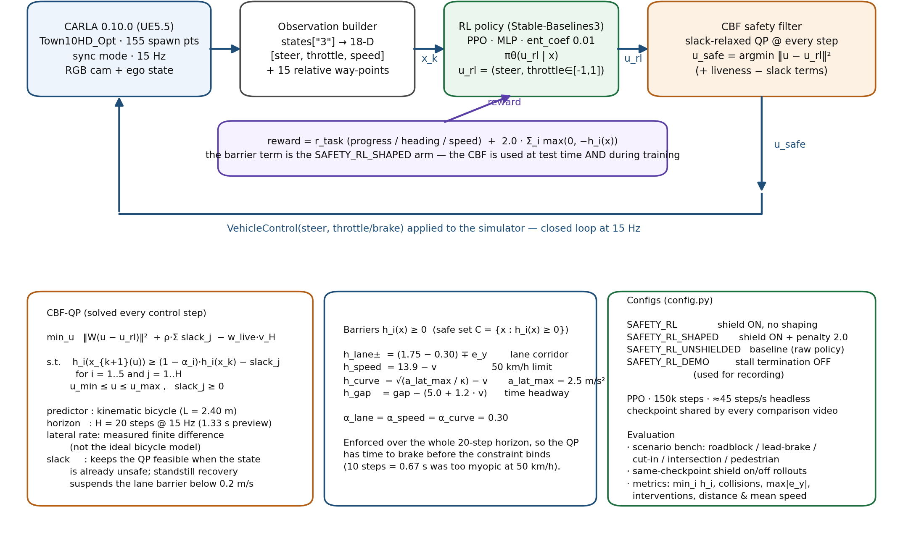
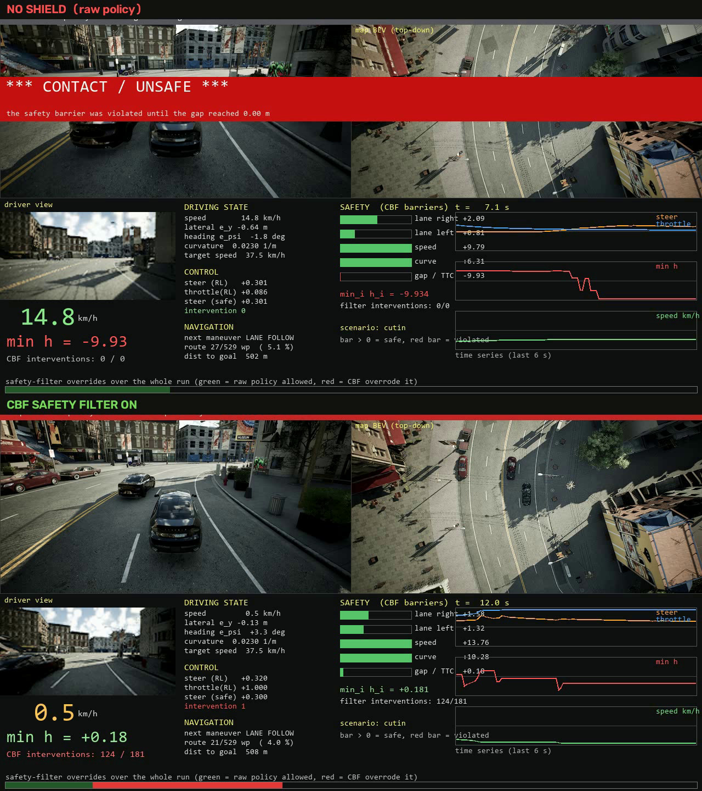
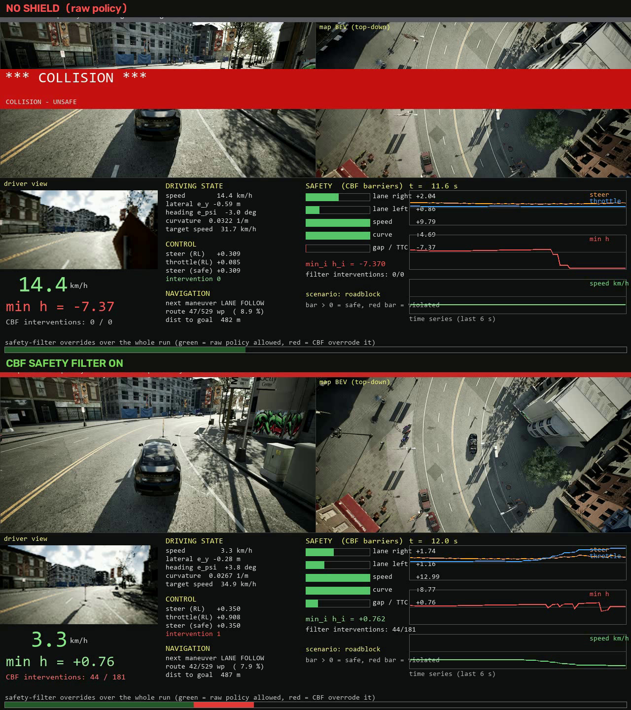
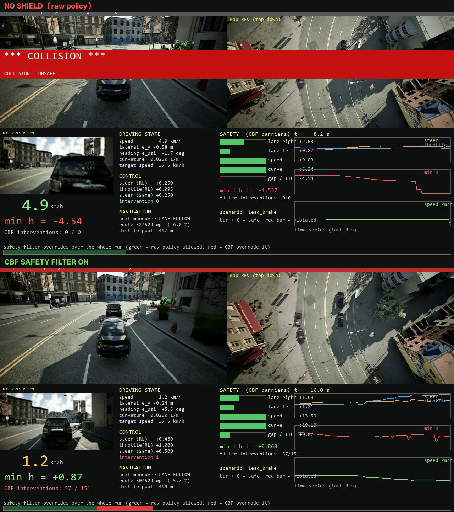
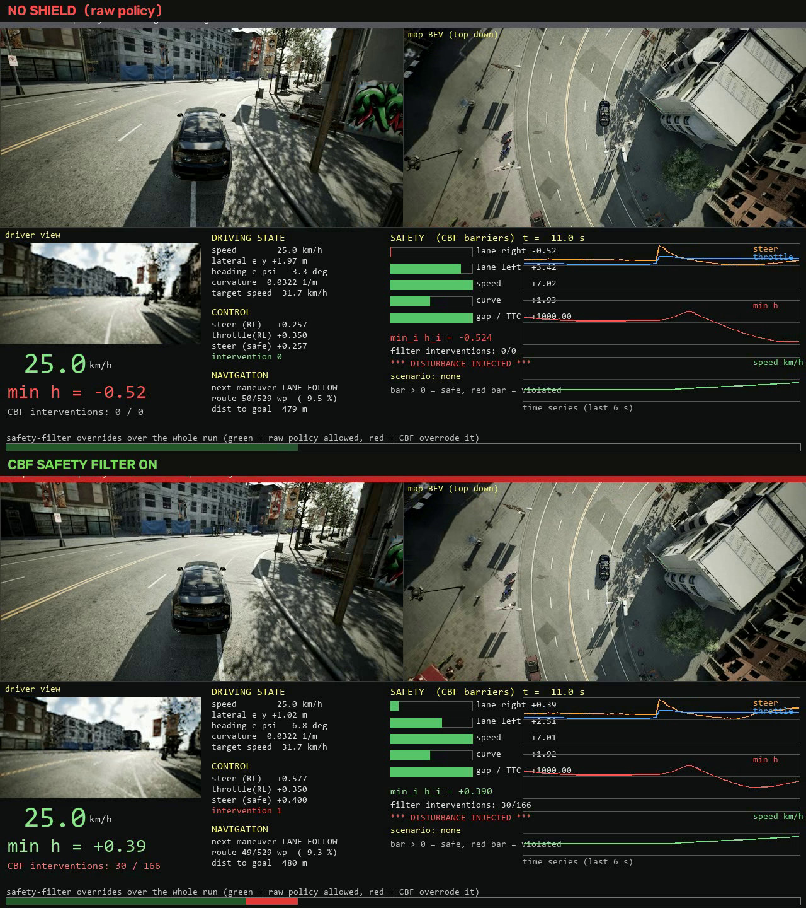
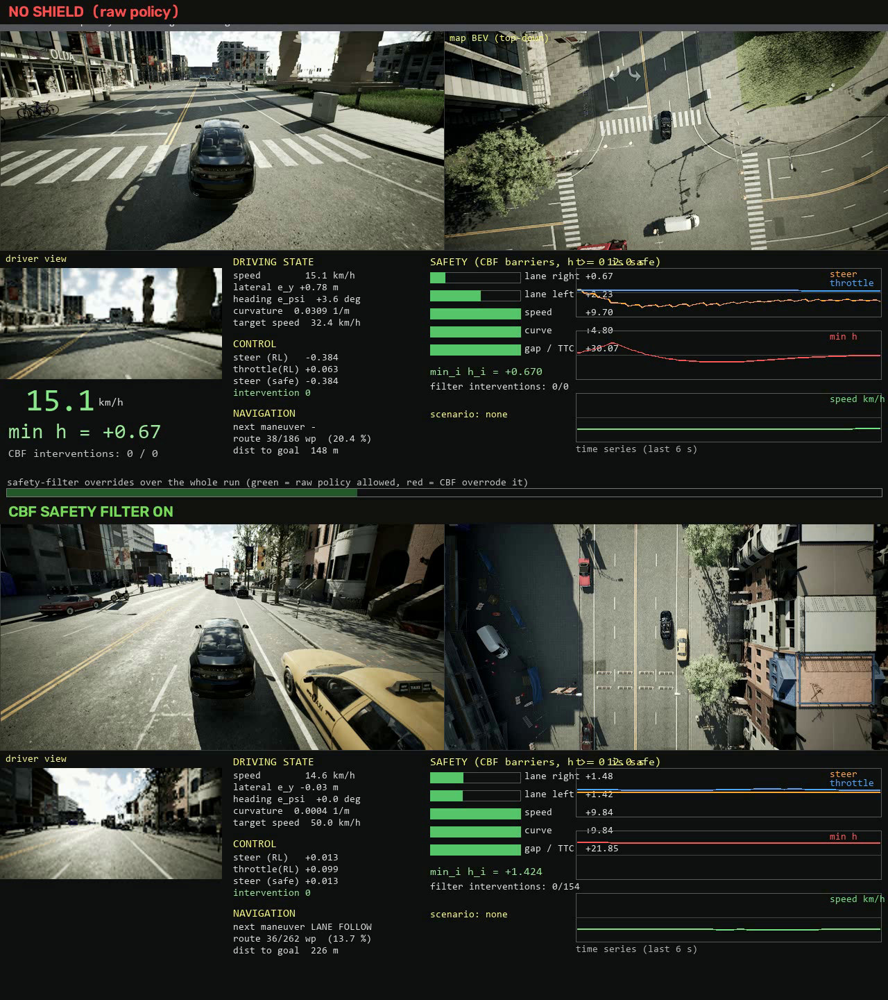
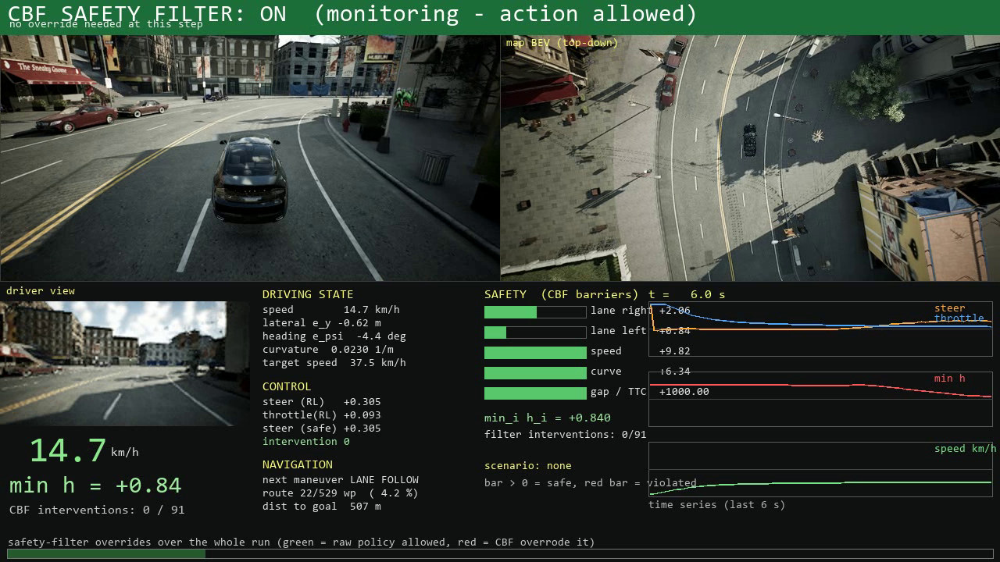
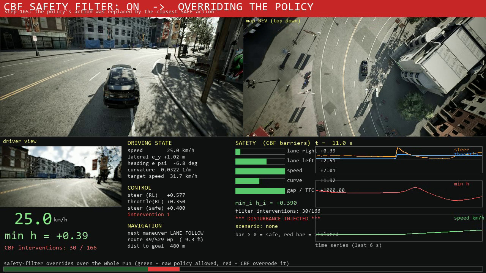
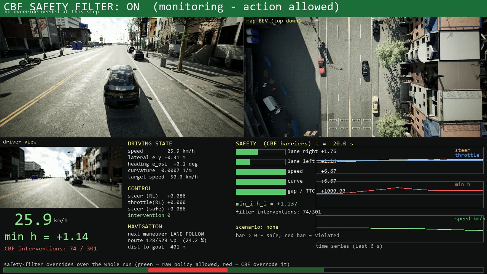

# 🚗 CARLA-SB3-RL-Training-Environment

本仓库是 CARLA-SB3-RL-Training-Environment 的 fork。上游由 Alberto Maté 在 UC3M 的本科毕业论文
*Application of Deep Reinforcement Learning in autonomous driving* 中完成，提供 CARLA 与
[Stable-Baselines3](https://stable-baselines3.readthedocs.io/en/master/) 的训练和评估环境；
上游要求 CARLA 0.9.13，只在 Town02 上验证过。

本 fork 在上游基础上做了两件事：把它移植到本机唯一可用的 CARLA 0.10.0（UE5.5 / Town10HD_Opt），
并在策略与仿真器之间加入 CBF（control barrier function）安全滤波器、把 barrier 违反量写进 reward。
逐条改动见 [`docs_safety/01-环境审计与移植记录.md`](docs_safety/01-环境审计与移植记录.md)。

上游 README 的安装、配置与训练说明保留在文末「上游功能」一节；文中命令与参数以本 fork 的实际用法为准。

<p align="center">
  
</p>

---

## 🧠 算法框架 / Algorithm framework

数据流见 `docs/images/rl_cbf_framework.png`，矢量版 `.svg` 在同一目录。

闭环以 15 Hz 运行，CARLA 工作在同步模式：

1. **仿真器**：CARLA 0.10.0，车辆为 `vehicle.lincoln.mkz`（本机 0.10 构建没有 `vehicle.tesla.model3`），
   地图 Town10HD_Opt，共 155 个 spawn point。
2. **观测**：`states["3"]`，18 维，即 `[steer, throttle, speed]` 加 15 个相对路点。
   用 `states["1"]` 时观测里没有横向信息，策略只能平行于车道行驶，82% 的 episode 以 Off-track 结束。
3. **策略**：SB3 PPO，输出归一化动作 `u_rl = (steer, throttle)`，油门范围 [−1, 1]
   （`allow_brake=True`，负值为刹车），`action_smoothing = 0.0`。
4. **安全滤波**：每个控制步解一个 QP，把 `u_rl` 投影到安全集：

   ```
   u_safe = argmin_u  ‖W (u − u_rl)‖²  + ρ·Σ slack_j  − w_live·v_H
            s.t.  h_i(x_{k+1}(u)) ≥ (1 − α_i)·h_i(x_k) − slack_j ,  i = 1..5,  j = 1..H
                  u_min ≤ u ≤ u_max ,  slack_j ≥ 0
   ```

   预测模型是运动学自行车（L = 2.40 m），时域 H = 20 步 @ 15 Hz，即 1.33 s；横向速率取自实测差分，
   不用理想模型，因为在这台车上的模型误差与车道余量同量级。目标函数里的 slack 松弛、standstill recovery
   与 liveness 项用于避免"停住不动"这个退化解。
5. **执行**：`VehicleControl(steer, throttle/brake)` 下发给仿真器，随后进入下一步。
6. **训练信号**：reward = 任务奖励（进度、航向、车速）+ 2.0 · Σ max(0, −h_i(x))，对应
   `SAFETY_RL_SHAPED`，即 CBF 在测试期与训练期都在使用。

**五条 barrier**（安全集 C = {x : h_i(x) ≥ 0}）：

| barrier | 公式 | 含义 |
| --- | --- | --- |
| `h_lane±` | `(1.75 − 0.30) ∓ e_y` | 车道走廊，半宽 1.75 m，另留 0.30 m 余量 |
| `h_speed` | `13.9 − v` | 限速 13.9 m/s，即 50 km/h |
| `h_curve` | `√(a_lat_max / κ) − v` | 按当前曲率 κ 限速，a_lat_max = 2.5 m/s² |
| `h_gap` | `gap − (5.0 + 1.2·v)` | 跟车时间头距，d_min = 5 m，τ = 1.2 s |

离散时间 CBF 的 class-K 增益统一取 α = 0.30，约束需在整个 20 步时域成立。时域取 20 步（1.33 s）是因为
10 步（0.67 s）在 50 km/h 下留给 QP 的刹车距离不够，约束开始生效时已经拉不回来。

`config.py` 提供四套配置：`SAFETY_RL`（开滤波，不做 shaping）、`SAFETY_RL_SHAPED`（开滤波，barrier
惩罚 2.0）、`SAFETY_RL_UNSHIELDED`（基线，裸策略）、`SAFETY_RL_DEMO`（关闭训练用的停车终止，供录像与评测）。

---

## 🎬 效果 demo 关键帧 / Demo keyframes

下图取自 `docs/images/demo_keyframes/`，是压缩后的 JPEG 副本；原始 PNG 在主仓库 `../demo_keyframes/`，
原视频在 `../` 与 `safety_results/demo/`，每段视频自带逐帧遥测 CSV。
三张对照图的上半为无滤波、下半为开启 CBF，两次使用同一个 PPO checkpoint、同一 seed、同一路线与障碍物。

| 关键帧 | 画面 |
| --- | --- |
|  | **加塞 cut-in**。上半无滤波：NPC 切入后急刹，0.00 m 接触，min h = −9.93，介入 0。下半开启 CBF：减速让行，0.5 km/h 停住，min h = +0.18，介入 124/181。 |
|  | **静态路障，前方 45 m**。上半无滤波碰撞，min h = −7.60；下半在 5.13 m 处停住并保持到录像结束。 |
|  | **前车急刹**。上半无滤波碰撞，min h = −4.98；下半保持 5.35 m 停住。 |
|  | **注入坏指令**。上半被带出车道；下半 CBF 改写动作，车留在车道内。 |
|  | **动态交通**。Traffic Manager 生成 14 辆自动驾驶车与 6 个行人（同步模式），BEV 与 gap / TTC 可见车流交互；默认车流不制造冲突，该段开与关滤波的差别很小。 |
|  | **主视频 · 正常行驶（t = 6 s）**。滤波不介入，策略动作原样通过。 |
|  | **主视频 · 介入（t = 11 s）**。策略动作越界，滤波器改写它，HUD 上 `steer (RL)` 与 `steer (safe)` 分离。 |
|  | **主视频 · 恢复（t = 20 s）**。车回到走廊内，滤波器把控制权交还策略。 |

HUD 面板自上而下为 driver view、map BEV（正上方 45 m 俯视）、DRIVING STATE（车速、$e_y$、$e_\psi$、
曲率、曲率允许车速）、CONTROL（策略动作与滤波动作、介入计数）、NAVIGATION（下一机动、路线进度、距终点）、
SAFETY（五条 barrier 实时条形、h = 0 边界、min h、介入次数）、三条时间序列，底部为整段介入条带
（绿 = 策略动作原样通过，红 = 被滤波器改写）。

---

## 🔧 本 fork 改了什么 / What this fork adds

完整审计见 [`docs_safety/01-环境审计与移植记录.md`](docs_safety/01-环境审计与移植记录.md)。

### 1. 移植到 CARLA 0.10.0

| 文件 | 改动 | 原因 |
| --- | --- | --- |
| `carla_env/wrappers.py` | 车型 `vehicle.tesla.model3` 改为 `vehicle.lincoln.mkz`；`color` 增加 `has_attribute` 保护；`load_world` 的 `town` 参数化 | 本机 0.10 构建只有 11 个车辆 blueprint，没有 tesla |
| `carla_env/envs/carla_route_env.py` | `import gym` 改为 `gymnasium`，`reset` / `step` 改为五元组；删除 Town02 专用硬编码路线，改为按当前地图随机采样 spawn 点对，可复现；新增 `collision_flag` 区分真碰撞与压线 / 超速 / 停车 | SB3 ≥ 2.4 使用 gymnasium API；本机只有 Town10HD_Opt，布局不同 |
| 同上 | `new_route()` 去掉 `set_simulate_physics(False/True)`，改为清零速度后 `set_transform` | 该软重置在 0.10.0 上会让自车失去物理，90% 油门 40 步只有 0.5 km/h；SB3 每次 `learn()` 开头都会 `reset()`，因此整轮训练都在跑一辆不能动的车。修后同条件为 36.1 km/h，可用 `tools_safety/probe_reset_physics.py` 复现 |
| `carla_env/navigation/local_planner.py` | `RoadOption` 补 `CHANGELANELEFT = 5`、`CHANGELANERIGHT = 6` | 上游缺这两项，路线规划报 `AttributeError` |
| `carla_env/state_commons.py` | `maneuver` 观测截断到 [0, 3]；`torchvision` 改为可选导入 | 新增的 5、6、−1 会让 SB3 的 `nn.Embedding` 下标越界，触发 CUDA device-side assert |
| `config.py` | 新增 `SAFETY*` 配置族，`vae_model=None`、`map=Town10HD_Opt`，并加 `safety` 配置块 | 不使用 VAE 才能无头训练；安全参数集中可调 |
| 运行环境 | 仓库内 venv（`--system-site-packages` 继承本机 torch 2.8+cu128），补装 SB3 2.9、gymnasium 1.3、opencv ≥ 4.10 | 复用已有的 CUDA torch |

### 2. 新增的安全层与工具

| 路径 | 内容 |
| --- | --- |
| `carla_env/safety/cbf.py` | barrier 定义、运动学预测、receding-horizon 约束、带 slack 与 liveness 的 QP 求解 |
| `carla_env/safety/wrapper.py` | gymnasium 安全壳，负责拦截动作、记录介入与 min h、可选的 reward shaping |
| `train_safety.py` | 带 shield 的训练入口。上游 `train.py` 没有安全层，且强依赖 VAE |
| `tools_safety/` | 单测 `test_cbf.py`、冒烟、场景库 `scenarios.py`、评测台 `run_scenarios.py`、录制 `make_demo_video.py`、设置审计 `check_simulator_settings.py`，以及一批探针脚本 |
| `docs_safety/` | 审计与报告：01 移植记录、02 报告、03 仿真器设置审计、04 交互场景现状、05 参考控制器的隐藏 bug |

### 3. 实测效果

下表各组都用同一个 checkpoint，只切换滤波器。

| 指标 | 无滤波 | 有 CBF |
| --- | ---: | ---: |
| 场景挑战评测台（路障 / 前车急刹 / 加塞 / 路口 / 行人） | 2 / 5 通过 | 5 / 5 通过 |
| 最差 min h（5 集） | −0.53 | −0.15 |
| 最差 \|e_y\|（车道半宽 1.75 m） | 1.98 m，出车道 | 1.60 m，在车道内 |
| 行驶距离 / 均速 | 126.6 m / 17.1 km/h | 127.3 m / 17.2 km/h |
| CBF 单测 / 仿真器设置审计 | — | 7/7 与 13/13 通过 |

---

## 📥 Installation

```powershell
# 0) CARLA：本机固定使用这个版本与路径，0.9.x 在 RTX 5060 Ti / Win11 上无法启动
Start-Process "E:\carla\Carla-0.10.0-Win64-Shipping\CarlaUnreal.exe" `
  -ArgumentList "-quality_level=Low","-RenderOffScreen","-nosound","-prefernvidia","-carla-world-port=2000"

# 1) 环境：仓库内 venv，已在 .gitignore 中忽略
E:\anaconda3\envs\audiobook\python.exe -m venv --system-site-packages venv
.\venv\Scripts\python.exe -m pip install "stable-baselines3>=2.4" "gymnasium>=1.0" "opencv-python>=4.10" pygame
```

## 🛠️ Usage

```powershell
# 滤波器单测
.\venv\Scripts\python.exe tools_safety\test_cbf.py

# 训练 RL baseline，不带 shield，约 55 分钟 / 150k 步
.\venv\Scripts\python.exe -u train_safety.py --config SAFETY_RL_UNSHIELDED `
  --no_render --no_rendering_mode --total_timesteps 150000 --tag rl_long

# 实验三件套：同一 checkpoint 的开 / 关 shield 对照、场景评测台、演示视频
powershell -NoProfile -ExecutionPolicy Bypass -File .\tools_safety\run_rl_experiments.ps1
```

`--no_rendering_mode` 只在观测里没有图像时可用，本仓库的 RL 配置符合该条件；它关闭服务器渲染，
训练速度从约 26 步/秒提高到约 45 步/秒。带相机的录视频脚本不要加这个开关。

录像使用 `SAFETY_RL_DEMO`：除关闭训练用的停车终止外，与 `SAFETY_RL` 相同。开滤波后车被正确刹停在
障碍物后方时，训练用的终止条件会提前结束 episode，画面会定格在横幅上，看起来像碰撞。

结果写在 `safety_results/`（`demo/` 存放视频与逐帧遥测，`shielded` / `unshielded` 存放训练期逐集指标，
`logs/` 存放运行日志），训练曲线在 `tensorboard/`。

## 📁 主要目录

| 路径 | 内容 |
| --- | --- |
| `carla_env/` | gymnasium 环境、观测与奖励、wrappers，以及 `safety/`（CBF 与安全壳） |
| `train_safety.py`、`eval.py`、`eval_plots.py` | 训练与评估入口 |
| `tools_safety/` | 单测、场景、评测台、录制与探针脚本 |
| `docs_safety/` | 审计记录与报告源码、PDF |
| `docs/images/` | 上游插图，以及本 fork 的 `rl_cbf_framework.png` / `.svg` |
| `safety_results/`、`tensorboard/`、`venv/` | 运行产物与本地环境，均不进版本库 |

## ⚠️ 已知限制

1. 本机 CARLA 0.10.0 构建只有 `Town10HD_Opt` 与 `Mine_01` 两张地图、11 个车辆，上游的 Town01/02 路线、
   预训练 VAE 与历史 checkpoint 都无法复用。
2. 阻挡场景里车会歪着停住：车道 barrier 与"必须动起来才能回正"互相锁死。现在靠 liveness 项与横向、
   纵向通道分离绕过，根治需要把 QP 写成带 slack 的软约束。
3. 静态障碍物没有专属 barrier。五条 barrier 中只有 `h_gap` 关注前方车辆，路边静止的车辆与建筑不在安全集内。
4. 滤波器把残余越界从 −0.53 压到 −0.15，但没有完全消除，来源是单步模型误差与 slack。可行的方向是更长
   时域的预测滤波，或训练期就纳入 CBF，`SAFETY_RL_SHAPED` 已经提供。
5. RL baseline 稳定在约 17 km/h、单次约 126 m / 26 s；不开滤波时有 3/5 个 episode 出车道。

---

## 上游功能 / Upstream features

以下内容来自上游 README（Alberto Maté, UC3M）。上游要求 CARLA 0.9.13，并依赖 Town02 的路线与 VAE 观测，
在本机不能直接运行。

**配置（`config.py`）**：`algorithm` 支持 SB3 的任意算法；`algorithm_params` 为其参数；`state` 为观测项列表，
见 `carla_env/state_commons.py`；`vae_model` 可取 `vae_64`、`vae_64_augmentation` 或 `None`；
另有 `action_smoothing`、`reward_fn` 与 `reward_params`（见 `carla_env/reward_functions.py`）、
`obs_res`、`seed`、`wrappers`。

**训练与评估（上游命令）**：

```bash
python train.py --config 0 --total_timesteps 1000000     # 训练，曲线在 tensorboard/
python evaluate.py --config 0 --model <checkpoint>       # 评估，路线在 carla_env/envs/carla_env.py 的 eval_routes
python run_experiments.py                                # 批量训练与评估
python vae/train_vae.py --epochs <N>                     # 训练 VAE
python carla_env/envs/collect_data_manual_env.py         # 手工采集数据
python carla_env/envs/collect_data_rl_env.py             # 用早期 RL 策略自动采集数据
```

上游插图保留在 `docs/images/`：`architecture.png`、`rl_train.gif`、`vae_comparation.png`、
`Town02_spawnpoints.png`。

## 出处与引用 / Attribution

* 上游仓库 CARLA-SB3-RL-Training-Environment，作者 Alberto Maté，UC3M 本科毕业论文
  *Application of Deep Reinforcement Learning in autonomous driving*。
* 本 fork 的移植与 CBF 安全层由 Li Ruiqin 完成，2026-10。
