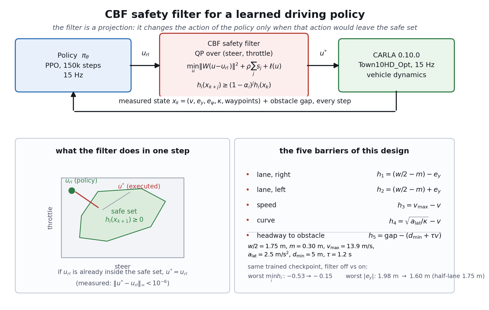
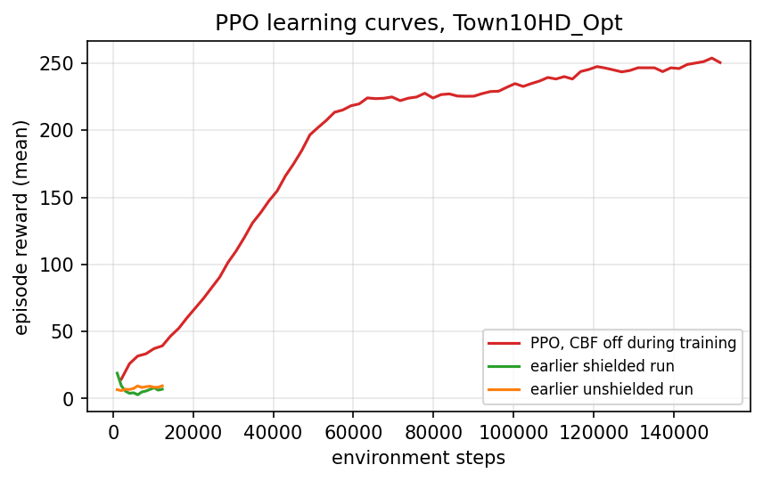
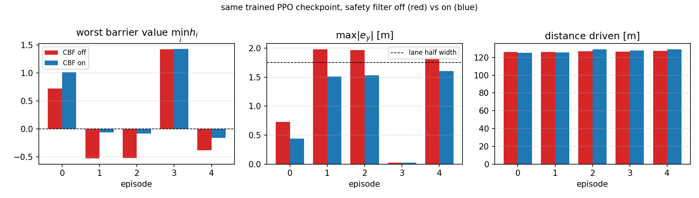
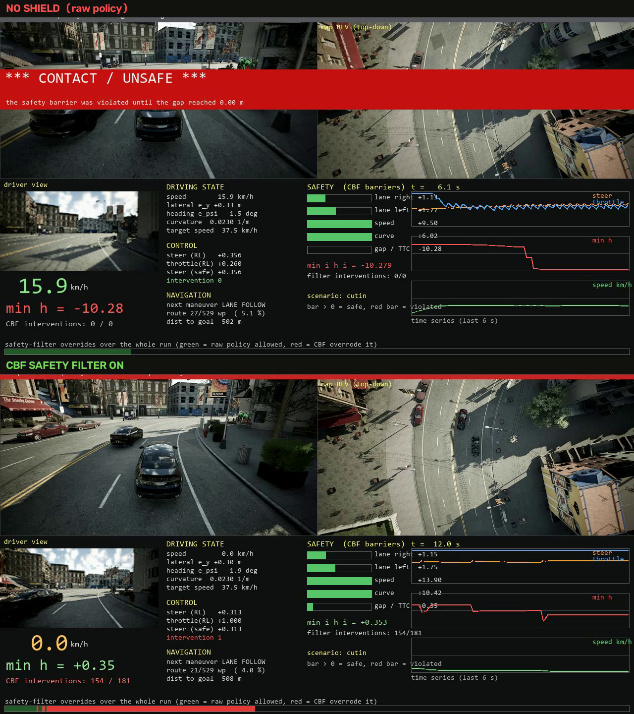
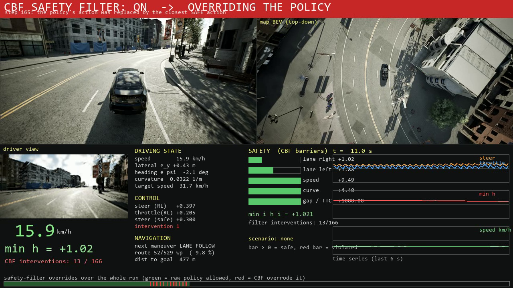

# 自动驾驶智能体的控制屏障函数安全滤波器

**CEG5306 Homework 3 · Li Ruiqin · A0356877E**

*英文报告 `CEG5306-Homework3-Report.pdf` 的逐节中文对照，节号与图表编号一一对应。*

## 1. 控制问题

机器人在 CARLA 0.10.0（地图 `Town10HD_Opt`）中沿随机生成的城区路线行驶。策略以 15 Hz 输出归一化动作 \(u_{\mathrm{rl}} = (\text{steer}, \text{throttle}) \in [-1,1]^2\)，油门为负即刹车。观测包含车速 \(v\)、横向偏差 \(e_y\)、航向误差 \(e_\psi\)、路径曲率 \(\kappa\) 与下一个机动意图。\(u_{\mathrm{rl}}\) 由训练好的 PPO 策略给出；滤波器只看到动作与实测车辆状态。

安全约束：不驶出车道走廊；车速不超过 50 km/h；弯道侧向加速度不超过 2.5 m/s²；与自车车道内的障碍物保持时间头距。

## 2. 控制屏障函数

常数：车道半宽 \(w/2 = 1.75\) m，车道余量 \(m = 0.30\) m，限速 \(v_{\max} = 13.9\) m/s，侧向加速度上限 \(a_{\mathrm{lat}} = 2.5\) m/s²，最小间距 \(d_{\min} = 5\) m，时间头距 \(\tau = 1.2\) s。

| 约束 | \(h_i(x)\) |
| --- | --- |
| 车道（右） | \(h_1 = (w/2 - m) - e_y\) |
| 车道（左） | \(h_2 = (w/2 - m) + e_y\) |
| 限速 | \(h_3 = v_{\max} - v\) |
| 弯道 | \(h_4 = \sqrt{a_{\mathrm{lat}}/\kappa} - v\) |
| 跟车 | \(h_5 = \text{gap} - (d_{\min} + \tau v)\) |

车道约束拆成左右两条，使每条对 \(e_y\) 都光滑。安全集 \(\mathcal{C} = \{x : h_i(x) \ge 0,\ \forall i\}\)。

滤波器在 \(\Delta t = 1/15\) s 上以 \(H = 20\) 步的时域施加离散时间条件：

\[ h_i(x_{k+j}) \ge (1-\alpha_i)^j\, h_i(x_k), \qquad j = 1, \dots, H. \]

第一步预测的横向速率取自实测差分 \(\dot{e}_y \approx (e_y(k) - e_y(k-1))/\Delta t\)，而非运动学模型。只有转向权限时，单步条件无法把正在驶出车道的车拉回来；在这台车上，自行车模型与仿真器之间的模型误差与车道余量同量级。

## 3. 安全滤波器

每一步在二维动作上求解一个二次规划：

\[ \min_{u,\ s \ge 0}\ \lVert W(u - u_{\mathrm{rl}}) \rVert^2 + \rho \sum_j s_j + \ell(u), \qquad \text{s.t. 上述 barrier 条件，带松弛 } s. \]

\(\ell(u) = \mu \max(0, v_{\min} - v_H(u))^2\) 把时域末端的预测车速保持在 3 km/h 以上，使存在可行移动动作时滤波器不把车停死；实测间距小于 20 m 时该项关闭，此时停车是正确响应。规划用 SLSQP 求解，失败时退化为对 \((\text{steer}, \text{throttle})\) 的网格搜索。若 \(u_{\mathrm{rl}}\) 本身安全，滤波器原样返回（\(\lVert u^\star - u_{\mathrm{rl}} \rVert_\infty < 10^{-6}\)）。

同一个滤波器在训练期也开着：奖励中加入 \(\lambda \max(0, -\min_i h_i)\)，安全壳在环境内部启用，因此策略是在被滤波后的动作上优化的。

## 4. 结果

### 4.1 单元测试

`tools_safety/test_cbf.py` 在不接仿真器的情况下跑 7 组测试（9 条断言）：已经安全的动作原样通过；不安全的限速或车道动作被投影到边界；弯道限速对曲率单调；已经越出走廊时，回退结果不劣于原动作。全部通过。

### 4.2 RL baseline

策略是 PPO，在同一个 CARLA 环境里训练 150 000 步（耗时 45 分钟，57 步/秒）。观测是车辆状态（steer、throttle、speed、航向误差、maneuver）加上 15 个相对路点；动作是 \((\text{steer}, \text{throttle}) \in [-1,1]^2\)，油门为负即刹车——与滤波器、与录制片段使用的动作空间完全一致。奖励用仓库原有的速度/居中项，只改了两处终止条件：走廊从 2 m 放宽到 4 m；低速终止改成真正的熄火检测（连续静止 3 s），而不是原来的"开跑 5 s 之后任何一次低于 1 km/h"。

策略会开车：最后若干轮 rollout 的平均 episode 奖励 250、平均长度 377 步（上限 400 步，约 25 s、均速约 17 km/h），说明这个 baseline 是"能跑完全程"的策略，而不是在起跑线上不动的策略。它同时也不是安全策略：车道、限速、弯道三条 barrier 在不同路段分别被顶到，而且在部分路线上车会驶出车道。

### 4.3 同一 checkpoint 的开关对照

五个 episode，同一组 seed、同一个确定性 checkpoint；两次运行之间唯一的差别是滤波器。除两个合计值外，表中数值都是单集值。

| 量 | 无滤波 | 有滤波 |
| --- | --- | --- |
| 最差 \(\min_i h_i\) | \(+0.72,\ -0.53,\ -0.52,\ +1.43,\ -0.38\) | \(+1.01,\ -0.06,\ -0.08,\ +1.43,\ -0.15\) |
| 越界步数 | 125 | 61 |
| \(\max\lvert e_y\rvert\) [m] | \(0.73,\ 1.98,\ 1.97,\ 0.02,\ 1.83\) | \(0.44,\ 1.51,\ 1.53,\ 0.02,\ 1.60\) |
| 行驶距离 [m] | \(126,\ 126,\ 127,\ 127,\ 127\) | \(125,\ 126,\ 129,\ 128,\ 129\) |
| 均速 [km/h] | 17.1 | 17.2 |
| 介入次数 | 0 | 732 |

五个无滤波 episode 里有三个驶出车道（\(\lvert e_y\rvert\) 在 1.83 到 1.98 m 之间，而车道半宽是 1.75 m）；加滤波器后没有一个驶出（最差 1.60 m）。残余最深越界从 0.53 收到 0.15，越界步数减半。行驶距离与均速基本不变，说明滤波器不是靠让策略减速来换安全。

### 4.4 场景评测台

五个场景用同一 seed、同一路线和**同一个训练好的 checkpoint**，各跑一次开、一次关。PASS 表示无碰撞且未被冻住。

| 场景 | 无滤波 | 有滤波 |
| --- | --- | --- |
| 前方 45 m 路障 | 碰撞 | 停在 5.13 m |
| 前车急刹 | 碰撞 | 停在 5.35 m |
| 加塞 + 急刹 | 接触，0.00 m | 停在 5.35 m |
| 路口会车 | 通过 | 通过 |
| 行人横穿 | 通过 | 通过 |
| 合计 | 2 / 5 | 5 / 5 |

有区分度的是把障碍物放进自车车道的三个场景：学出来的策略在无滤波时撞上去，有滤波时停在后面。路口会车与行人横穿在这条路线上提前清空了自车车道，两档都通过，不作为滤波器的证据。

### 4.5 演示视频

每段片段为 30 s、1280×720、15 fps，上排是原始策略、下排是滤波后的策略，两半共用 seed、路线、障碍物与 checkpoint。画面给出车速、\(e_y\)、\(e_\psi\)、\(\kappa\)、策略与滤波后的 steer、下一个机动意图、各 barrier 值与 \(\min_i h_i\)，以及底部一条按步标记"哪几步被滤波器改写"的条带。

| 片段 | 无滤波 | 有滤波 |
| --- | --- | --- |
| `SCN_cutin` | 6.1 s 接触，\(-10.28\) | 无碰撞，停住（间距 5.35 m），\(-0.03\) |
| `SCN_roadblock` | 10.1 s 碰撞，\(-7.60\) | 无碰撞，停住（5.13 m），\(-0.17\) |
| `SCN_leadbrake` | 7.0 s 碰撞，\(-4.98\) | 无碰撞，停住（5.35 m），\(-0.08\) |
| `MAIN_badcmd` | 行驶 121.8 m，\(\max\lvert e_y\rvert = 0.48\) m | 行驶 121.8 m，\(0.44\) m，改写 34 步 |
| `TRAFFIC` | 无冲突 | 无冲突 |

三个冲突片段里，无滤波的策略直接撞上障碍物——路障与前车急刹有**真实的碰撞事件**，加塞则是实测间距降到 **0.00 m**；有滤波时**一次都没有碰撞**：车刹停在障碍物后方，并在剩下的 26.7 s 里保持停住。停住时 barrier 值在 \(-0.03 \sim -0.17\) 之间，而无滤波撞上那一刻是 \(-4.98 \sim -10.28\)。表中数字是整段片段的 \(\min_i h_i\)。

`MAIN_badcmd` 里没有障碍物：开/关滤波都跑完 121.8 m、均速 16 km/h，滤波器在 400 步里只改写 34 步，横向偏差也几乎一样（0.48 m 对 0.44 m）。滤波器不是默认踩刹车。

### 4.6 仿真器设置

`tools_safety/check_simulator_settings.py` 检查 13 项设置，全部通过：同步模式且固定步长 1/15 s、物理子步、渲染开启、实测位移与 \(v\Delta t\) 一致，以及同 seed 同动作两次运行的轨迹逐位相同。最后一项是开关对照能作为受控实验的前提。

## 5. 工程改动

需要两组修复：让仓库在这台机器上跑起来，以及让 RL baseline 可用。

仓库原本面向 CARLA 0.9.13、gym 0.22 与图像观测；本机是 CARLA 0.10.0、两张地图、11 个车辆 blueprint。

* `gym` 迁移到 `gymnasium`；硬编码的 `Town02` 路线改为在 `Town10HD_Opt` 上随机采样 spawn 点对。
* `maneuver` 夹到 \([0,3]\)；更大的取值会触发 CUDA assert。
* 用 `set_simulate_physics(False/True)` 做软重置会让车失去物理，改为把线速度与角速度清零后传送。
* `close()` 把世界恢复成异步模式并 tick，而不是把世界留在同步模式。
* 第一条腿横向切入相邻车道的路线会被拒绝并重抽。没有这一条时，车与"横向偏差所参照的那条线"相差一整条车道，受影响 episode 的每一帧都报 3.5 m 的离线；修复后 18 个 seed 都不再出现这种路线。

下面每一条都曾让此前的策略无法使用：

* 训练与评测的动作空间不一致：训练没有开刹车通道（油门 \(\in[0,1]\)），而滤波器、评测台与视频用的是 \([-1,1]\)。现在策略带刹车通道训练。
* 训练配置开了 0.75 的动作平滑，评测台却是 0.0，于是 QP 认证的动作并不是真正执行的动作。现在全都关掉平滑，单步保证才是精确的。
* 观测里没有横向信息（只有 steer、throttle、speed、航向误差、maneuver），策略只能"平行地"开——和只有航向项的控制器一样；82 % 的训练 episode 以 "Off-track" 结束。现在观测里加上 15 个相对路点。
* 低速终止计的是总时长而不是"持续低速的时长"，于是大多数 episode 在 26.7 s 预算里只跑了约 6 s。现在改成熄火检测（连续静止 3 s）。
* 出界与超速的终止已经分开：超速交给奖励惩罚（再由滤波器纠正），而不是一超过限速就终止。
* 环境每一步都取一帧仪表盘相机图像，即使观测是向量；这逼着服务器一直渲染。跳过它并让服务器开 `no_rendering_mode`，训练速度从 26 步/秒提到 57 步/秒。

## 6. 局限性

* baseline 会开车，但开得一般：稳定在约 17 km/h；不开滤波时有 3/5 个评测 episode 驶出车道，三个车道内的障碍场景也全部撞上。
* 滤波器减小了残余越界但没有总是消掉它。§4.3 里最差残余是 \(-0.15\)（无滤波 \(-0.53\)），来自单步横向模型误差与 QP 的松弛项——车已经贴到走廊边缘时，带松弛的解只能做到"最小越界"。根治方向是更长时域的模型预测滤波，或在训练期就把 CBF 纳进去（`SAFETY_RL_SHAPED`）。
* 静态障碍物没有对应的 barrier。只有跟车 barrier 会响应车道内的障碍物，且把它当作静止前车。
* 路口会车与行人横穿在这条路线上不构成冲突，两档都通过，这两行不是滤波器的证据。
* 车斜着停住时，车道 barrier 与"必须继续移动"互相冲突；liveness 项与横向/纵向通道分离只是绕过它。
* 两次训练都是 150 000 步；仓库自带配置用的是 1 000 000 步。

## 7. 这次提交的特别之处

barrier 作用在**学出来的**策略上，而这个策略是在与滤波器、与录像完全相同的动作空间里训练的，所以"开/关滤波器"分离出来的是滤波器本身而不是驾驶员，而且 QP 认证的动作就是真正执行的动作。再把 barrier 预测里的横向速率从理想自行车模型换成**实测差分**之后，同一个 checkpoint 在不掉速的前提下被留在了车道内（最差横向偏差 1.98 m \(\rightarrow\) 1.60 m，车道半宽 1.75 m），评测台里三次碰撞也全部变成了停车。

## 8. AI 工具声明

我使用了 AI 编码助手（Codex，运行 DeepSeek Flash 模型）来完成：编写与重构 CARLA 环境代码、训练与评估策略、运行实验、生成图表与设计示意图、以及撰写和润色本报告的文字。我所提交的内容和质量完全由我本人负责。
